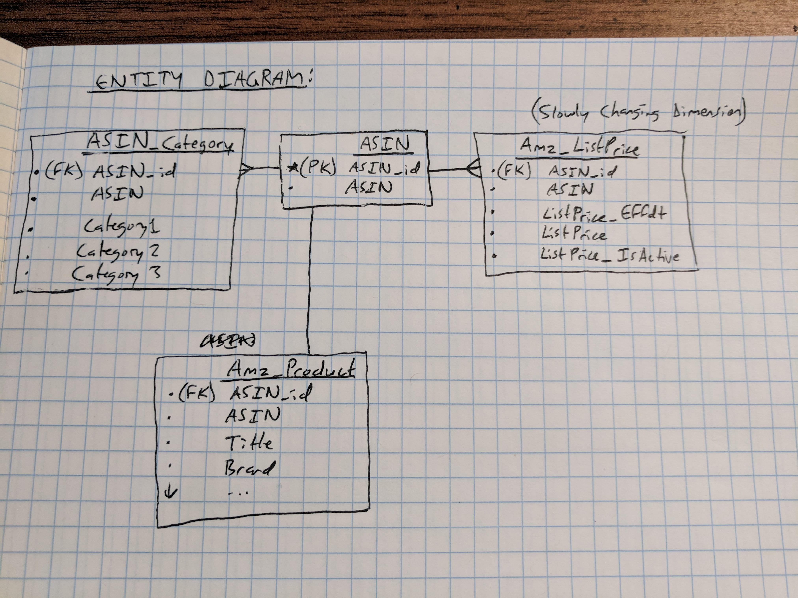

# sfx_price_scraper
price scraper. using amazon product advertising API. storing in type-2 slowly changing dimensions database in AWS.

## entity diagram for persistent storage

* **ASIN** - this is the record holder for which ASIN are being tracked in this app
* **ASIN_Category** - I made this table because a single ASIN can have multiple categories associated with it, and I don't want that logic to live in the UI and I don't want to make independent requests for one ASIN simply because it is associated with multiple categories
* **Amz_Product** - this is at the same dimension as the ASIN table, so they are one-to-one. This is a separate table because the action of entering in a new ASIN to track is separate from the action of requesting all of this data from the Amazon API. This is a kill-and-fill table after each request to the API, so there will not be any visibility into historical changes to the product dimension. Changes overwrite at the time of each API call.
* **Amz_ListPrice** - this is the slowly changing dimension table that captures price changes over time. When a response from the API shows a different value for the list price than what is currently stored in the database, I set the previously "current" record to "inactive", then insert the new row. This is done **inside of a transaction** so that if the insert fails, I can roll-back the previous statement as well.

## version info:

* MS SQL Driver [here](https://packages.microsoft.com/ubuntu/18.04/prod/pool/main/m/msodbcsql17/)
    - otherwise pick one from [here](https://docs.microsoft.com/en-us/sql/connect/odbc/download-odbc-driver-for-sql-server?view=sql-server-2017)

* OS Local:  Ubuntu 18.04.1 LTS
* OS Remote: Ubuntu 18.04.1 LTS (VM is running on Azure)
* R: 3.5.0
    - odbc: 1.1.6  (have to install unixodbc-dev first - and the MS SQL driver)
    - DBI: 1.0.0
    - dplyr: 0.7.6
    - tidyr: 0.8.1
    - ggplot2: 3.0.0
    - XML: 3.98.1.15  (have to install libxml2-dev first)
    - lubridate: 1.7.4
    - base64enc: 0.1.3 (for signing amazon requests)
    - digest: 0.6.15   (for signing amazon requests)
    - RCurl: 1.95.4.11 (have to install libcurl4-openssl-dev first)
* SQL Server Linux Driver: "ODBC Driver 17 for SQL Server"

